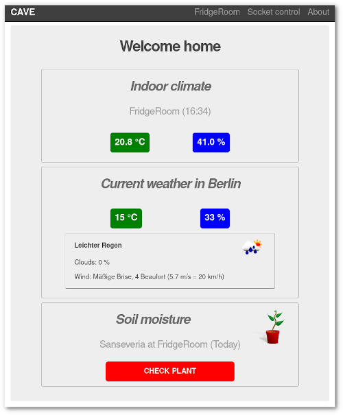
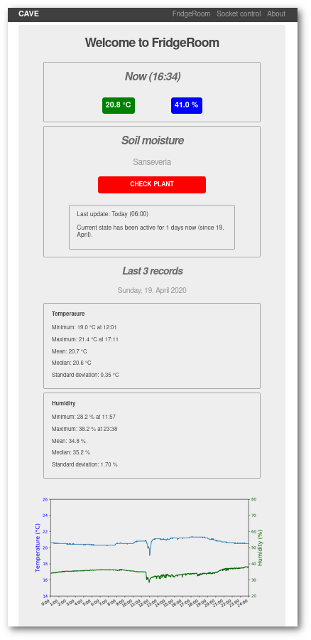
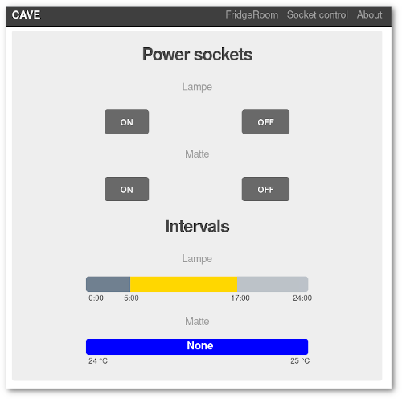

# Introduction

The *Controlled Atmosphere Visualization Entity* application (CAVE) is a webapp to monitor some common sensors on one or more Raspberry Pi's. To make CAVE work you will have to get the Flask app running as well as some scripts/daemons to collect and display data.

## Components

There are several components that can be configured. Any component is optional. The main reason for creating CAVE was showing current and past sensor data and controlling power switches. Other components are weather using the openweathermap.org API and a Kettlebattle generator which is also available as a standalone app (see [GitHub repository](https://github.com/encarsia/kbgen)).

### Sensors

Currently CAVE is capable reading data from the widely-used and cheap air temperature and humidity sensor DHT22 and soil moisture sensor YL-69 - current sensor data, plots of the past days and log tables of average statistic values can be displayed.

### Radio controlled power sockets

There are plenty of manufacturers and models available. Any product that is supported by *raspberry-remote* should do. A 433 MHz sender is required for sending commands to sockets.

See [GitHub Home of raspberry-remote](https://github.com/xkonni/raspberry-remote) for details. If not sure you might want to buy a Brennenstuhl product.

You can setup CAVE to automatize switching sockets by time and temperature ranges.

### Camera preview

Use the Rasberry Pi camera module to show a photo (shot every 10 minutes).

### Weather

Weather data is provided by [OpenWeatherMap](https://openweathermap.org).

### Kettlebattle Generator

Yes, that's a thing. For more information see the [Kettlebattle standalone app (currently archived)](https://github.com/encarsia/kbgen).

## Routes

* `/` or `/index`: configured devices and current sensor values, weather
* `/ConfiguredPi`: each device has its subpage showing current data, stats and plots of the last 3 days and sensor log tables
* `/powersockets`: switch sockets, show temp/time ranges if configured
* `/preview`: Show current photo
* `/about`: show device, application and configuration information
* [extra] minimalistic autorefreshing routes adjusted to a 3.2" LCD:
    * `/weather_min`, `/ConfiguredPi_min`, `/powersockets_min`

# How to start

1. Clone the Git repository or download and unpack the archive.
1. Set up the webapp.

## Required packages

* Python 3
* Flask web framework
* Flask Mail extension
* Apache2 webserver
* PyYAML
* APScheduler

Install in Rasbian/Debian:

```bash
$ sudo apt-get install python3 python3-flask python3-flask-mail apache2 libapache2-mod-wsgi-py3 python3-yaml python3-apscheduler
```

## Optional packages

* run multiple devices (server+client(s)): Paramiko (*python3-paramiko*)
* PiGlow extension hat (*python3-piglow*)
* DHT11/22 sensor:
    * Adafruit_DHT package from [GitHub repository](https://github.com/adafruit/Adafruit_Python_DHT), see details below
    * Matplotlib (*python3-matplotlib*)
* YL-69 sensor: RPi.GPIO (*python-rpi.gpio*)

Install in Rasbian/Debian:

```bash
$ sudo apt-get install python3-paramiko python3-piglow python3-matplotlib python-rpi.gpio
```

In case you are using other distros you might have to install some packages via pip but I guess you know how that works...

# The server mode (webapp)

The webapp is intended to run on a (the primary) Raspberry Pi in the domestic network but it can run on any device capable of running a webserver. However it is not recommended to run a webserver on desktop systems.

## Create configuration file

It is inevitable to create a working configuration file.

As CAVE is still in early development it is not proven yet whether a Python or YAML formatted file is the better choice. Currently both options are possible. If a `server_conf.yaml` exists an existing `server_conf.py` will be ignored.

Use`example_server_conf.yaml` or `example_server_conf.py` as template and edit the file to your needs.

> :warning: **YAML configuration**: Avoid strings with spaces or put them in quotation marks.

## Check configuration

You can run `./check_config.py` to check if your configuration file makes some sense. Give file name as argument to check any other file than `server_conf.yaml`/`server_conf.py` (the script is trying to read a YAML first):

```bash
$ ./check_config.py my_other_conf
```

The script is able to:

* show configured modules
* create data folders for configured devices
* connect to network devices
* download CAVE data from network devices if available

## Test configuration

Run

```bash
$ ./cave.py
```

in a terminal to run the CAVE webapp with Flask's integrated webserver. CAVE then is available on [localhost:5000](http://localhost:5000/).
This procedure is only recommended for testing purposes. Productive usage is done via (Apache2) webserver.

## Test mail configuration

If you have enabled e-mail feedback, go to [localhost:5000/testmail](http://localhost:5000/testmail) to test your configuration. The page will also show occuring errors as depending on the provider the correct settings may be a little tricky. Good luck!

If everything is configured correctly, you will receive a daily sensor report for every device and the logfile.


## Apache2 webserver

After installing the Apache2 webserver and the *mod_wsgi* package  you have to specify the installation path of the webapp in `cave.wsgi`:

```python
#!/usr/bin/env python3
# -*- coding: utf-8 -*-

import sys
sys.path.append('/abs/path/to/cave')
from cave import app as application
```

Second create a virtual host for CAVE. Create a `cave.conf` and save it in `/etc/apache2/sites-available/`:


```xml
<virtualhost *:80>
	ServerName caveserver

	WSGIDaemonProcess caveserver user=pi group=www-data threads=5 home=/path/to/cave/
	WSGIScriptAlias / /path/to/cave/cave.wsgi

	<directory /path/to/cave>
		WSGIProcessGroup caveserver
		WSGIApplicationGroup %{GLOBAL}
		WSGIScriptReloading On
		Require all granted
	</directory>
	ErrorLog /path/to/cave/logs/apache_error.log
</virtualhost>
```

The user that CAVE is running with (default is "pi") has to be added to the *www-data* group:


```bash
$ sudo usermod -a -G www-data pi
```

Enable the site with a2ensite:

```bash
$ sudo a2ensite /etc/apache2/sites-available/cave.conf
```

If you get this

```bash
ERROR: Site /etc/apache2/sites-available/cave does not exist!
```

change into `/etc/apache2/sites-available/` and run

```bash
$ sudo a2ensite cave.conf
```

(Don't know why but it worked for me.)

Restart the webserver by running

```bash
$ sudo systemctl reload apache2
```

You can use any other webserver if you wish. See also

* [Serving a Python Flask Web Application via Apache Webserver in Raspberry Pi](http://www.ashokraja.me/post/Serving-a-Python-Flask-Web-Application-via-Apache-Webserver-in-Raspberry-Pi.aspx)
* [Flask documentation: mod_wsgi (Apache)](http://flask.pocoo.org/docs/0.12/deploying/mod_wsgi/)
* [Flask documentation: Deployment options](http://flask.pocoo.org/docs/0.12/deploying/)

# The client mode

## Configuration

Devices that only collect sensor data do not run the whole apache server rubbish and complicated configuration but still you need a configuration file.

Use `example_client_conf.yaml` or `example_client_conf.py` as template and edit the file to your needs.

Corresponding to the server conf file a YAML file will be loaded first if available. Also a server conf file will always be loaded if available. See the log file if you are unsure about the current status.

Hierarchy of configuration files:

 1. `server_conf.yaml`
 1. `server_conf.py`
 1. `client_conf.yaml`
 1. `client_conf.py`

## Check configuration

You can run `./check_config.py -c` to check if your client configuration file makes some sense (the script is trying to read a YAML first).

## Run the client

Run

```bash
$ ./cave.py
```

This will not render any pages so watch the log file to see if everything works as intended. If so, quit the execution and add the script to your crontab to execute it at start:

```
@reboot python3 /abs/path/to/cave.py
```

## E-mail configuration

If you enable mail you will receive the daily log file. The sensor reports will only be sent by the server application because clients only collect but do not process sensor data.

# Set up sensors

## Soil sensors

The YL-69 soil moisture sensor is a cheap sensor that provides analogue and digital output. The Raspberry Pi natively only handles digital output. This indicates that only two states are stored: "0" meaning "dry" and "1" meaning "moist". An integrated potentiometer helps to adjust detection threshold ([read on](https://www.techcoil.com/blog/how-to-read-soil-moisture-level-with-raspberry-pi-and-a-yl-69-fc-28-moisture-sensor/)).

To avoid rapid corrosion the power supply is bound to a GPIO pin. This pin is only active while reading the sensor.

## Air sensors

For monitoring air temperature and humidity the widespread DHT22/DHT11 sensor is used. At midnight a plot and some statistics are generated.

There are two different packages available to obtain sensor data.

### Adafruit DHT - deprecated but reliable

The [Adafruit Python DHT Sensor Library](https://github.com/adafruit/Adafruit_Python_DHT) has been deprecated but works nonetheless. You can install it via

```bash
$ pip3 install Adafruit_DHT
```

or follow the instructions for an installation from the repository.

CAVE will try to import this package first because it is reliable.

### Adafruit CircuitPython DHT

The [Adafruit CircuitPython DHT](https://github.com/adafruit/Adafruit_CircuitPython_DHT) module is a pure Python package and currently supported by Adafruit.

I personally gave up on solving the issues (RuntimeErrors) with this package for now so I switched back to the legacy package which just does the job.

## Extra: use PiGlow

If there is a PiGlow mounted to your Raspberry Pi you can visualize some sensor data.
CAVE will turn on all LEDs on startup to signal that PiGlow is set up. The app will also automatically restarted by the Apache2 server so if you see all lights turned and the environment of the connected sensor is not in rainforest weather conditions there is probably something wrong and not working properly.

You have to specify the device whose sensor data shall be visualized in the config. This way you can use the PiGlow to show sensor data of another Rasberry Pi device in the network.

It is intended to use a PiGlow on the CAVE server device but you can also use it on a client. In that case it is only possible to display data of the very device because clients do not obtain data from other devices.

Currently data visualization is fixed.

### Temperature

* LEDs used: yellow, orange, red
* one LED per degree Celcius starting at 18 °C with yellow
* examples:
    * below 18 °C = no LED is turned on
    * 20.5 °C = all three yellow LEDs showing
    * 25.8 °C = all yellow (> 20 °C) and orange (> 23 °C) and two red LEDs showing
    * over 26 °C = all yellow, orange and red LEDs glowing

### Humidity

* LEDs used: blue and green
* one LED per 10 % starting at 30 % with blue
* examples:
    * below 30 % humidity no LED is turned on
    * 53 % = all three blue LEDs showing
    * 90 % = all three blue and three green LEDs showing

### Soil

* LEDs used: white
* lights are off if at least one sensor indicates "dry" state

> :warning: **NOTE** This could/should be somehow configurable so it better fits your needs. Suggestions appreciated.

# Set up radio controlled power sockets

## Installation

1. Install the package ``wiringpi`` from the repositories (probably already installed).

1. Clone the [raspberry-remote](https://github.com/xkonni/raspberry-remote) repository:

    ```bash
    $ git clone https://github.com/xkonni/raspberry-remote.git
    ```

1. Change into and compile ``send.cpp``:

    ```bash
    $ cd raspberry-remote/
    $ make send
    ```

1. If the compilation [fails](https://github.com/xkonni/raspberry-remote/issues/31), try to compile from the *dev* branch (worked for me):

    ```bash
    $ git checkout dev
    $ make send
    ```

1. Send a signal to an outlet:

    ```bash
    $ ~/Git/raspberry-remote/send 12345 2 1
    $ ~/Git/raspberry-remote/send 12345 2 0
    ```
## Configuration

There are two variables to use:

1. `DEF_SWITCH`: definitions for switches that you want to turn on/off via webapp, dictionary format
1. `SOCKET_INTERVALS`: turn power sockets on/off with given time or temperature range, dictionary format (optional)

See the example configuration files for details.

# ToDo

* add annotation module for additional information (photo, text)
* "admin" mode: show config in browser, reload webserver if edited
* implement alarm system
* detailed weather data (optional)
* enable PiGlow to display weather data instead of indoor sensors (optional)
* Workout module: add Tabata timer

# Screenshots

## Index page



## Raspberry PI detail page



## Remote power sockets page


